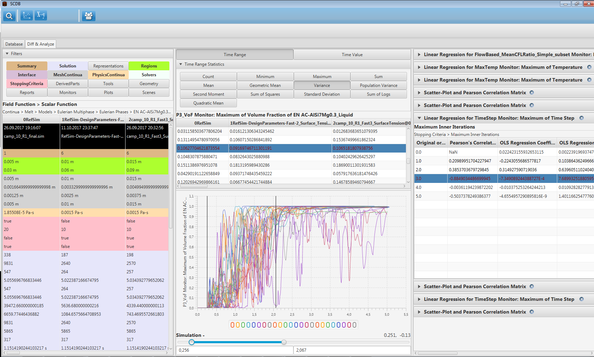

# Johannes Wasmer 

<!--  -->
<!--  -->

<!--  -->

- Bachelor: software engineering & applied math

- Master:
  - core: numerical methods & HPC
  - emphasis: computational solid state physics & data science

- Interests:

# Some projects I did

# Bachelor thesis

- 2017 at [Access e.V.](http://www.access.rwth-aachen.de/)

- Wrote a database for metal casting simulations

- Including a `diff` tool for simple statistical comparison of simulations

<!--  -->

# Guest student

- 2018 at [Jülich Supercomputing Centre](https://www.fz-juelich.de/ias/jsc)

- Wrote treemap visualization plugin for [Cube performance report explorer](https://www.scalasca.org/software/cube-4.x)

# Student assistant

- Koschmieder, L., Hojda, S., Apel, M. et al. AixViPMaP®—an Operational Platform for Microstructure Modeling Workflows. Integr Mater Manuf Innov 8, 122–143 (2019). https://doi.org/10.1007/s40192-019-00138-3

- Contributed to HDF5 exchange format of the platform

# Student lab

- 2019 at [Institute of Quantum Theory of Materials, Jülich](https://www.fz-juelich.de/pgi/pgi-1/EN) (Prof. Blügel)

- Product: [bandstructure and DOS visualization tool](https://github.com/JuDFTteam/masci-tools/tree/studentproject18ws/studentproject18w)

- Wrote a generic HDF5 preprocessor and the Jupyter GUI

# Master thesis

- 2020-2021 at [Institute of Quantum Theory of Materials, Jülich](https://www.fz-juelich.de/pgi/pgi-1/EN) with Dr. Rüßmann

<!-- - Contributing to the libraries -->
<!--   - [aiida-kkr-ml](https://iffgit.fz-juelich.de/aiida-kkr-ml): Machine learning potentials (MLPs) for [aiida-kkr](aiida-kkr.readthedocs.io/), -->
<!--   - [aiida-jutools](https://github.com/JuDFTteam/aiida-jutools/tree/develop), tools for [AiiDA](https://www.aiida.net/) users and developers, -->
<!--   - [masci-tools](https://github.com/JuDFTteam/masci-tools/tree/develop), materials science utilities. -->

- Product: [machine learning framework for a density functional theory code](https://iffgit.fz-juelich.de/aiida-kkr-ml)

- Investigating structural representations of impurity embeddings for surrogate models

# Sparetime 

- 2017-2020 Chairman of [OPH e.V.](https://www.oph.rwth-aachen.de)

- A charitable association providing living essentials to 200 students

<!-- # Live Demo -->

<!-- # Thesis Administrative Questions -->

<!-- > how many months will the actual project be and when exactly (if it is already fixed) -->

<!-- Regulations say 18 weeks, with max. 6 weeks extensions under exceptional circumstances. -->

<!-- > what are the exact formal requirements for the thesis from your university (number of hours per week, topic, ...) -->

<!-- - Hours per week: the thesis is 30 credit points, so 50 to 40 hours per week. -->
<!-- - Topic: no official restrictios. language: English. -->
<!-- - Colloquium may be held before submission of thesis. -->
<!-- - Registration process: may delay possible start to November. Because exam session here ends with October. -->
<!-- - external supervisor: must have a university degree. -->
<!-- - a time schedule must be worked out beforehand and handed in to the examination board before approval -->

<!-- # Thesis Administrative Questions -->

<!-- > will there be an official supervisor from Aachen? Do you already know who this could be? -->

<!-- Yes. It must be a professor of one of the departments affiliated with my course of study. Prof. Blügel would be suitable and I think willing. Other options can be explored. -->

<!-- > will you be done with all exams and work 100% of your working time on the thesis, or will you have other duties (e.g. pending exams or projects) in parallel? (It’s not a problem if it’s less than 100%, as long as we know what to expect) -->

<!-- Yes, if I pass all exams in summer, I will have one exam to finish in February / March, High Performance Computing, 6 credit points. -->

<!-- I can list all detailed regulations on request in a mail. -->

<!-- RISE pdf export pages: 5,10,11,12,15,16,19,20,24,25,26,30,31,34,35 -->
